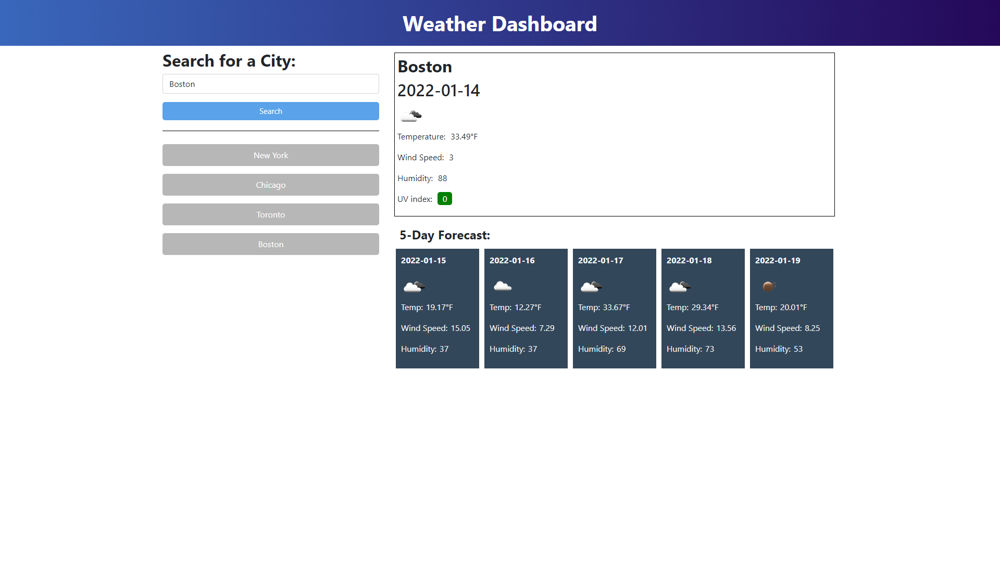

# Weather Dashboard

  ## Description
  This project was created with the goal of building a weather dashboard that runs in the browser and features dynamically updated HTML and CSS. Project was created using the OpenWeather API to retrieve data for the cities searched and localStorage to store the search history so users can quickly change the city back to a previous search without having to type it again. 
  
  ## Table of Contents
  - [Technologies](#technologies)
  - [Preview](#preview)
  - [Launch](#launch)

  ## Usage
  Travelers who want to see the weather outlook for multiple cities so that they can plan accordingly.
  ## Technologies
  - HTML
  - CSS
  - JavaScript
  - OpenWeather API
  ## Preview
  
  ## Launch
  [Github Pages](https://negronmarc.github.io/Weather-Dashboard/)
  
